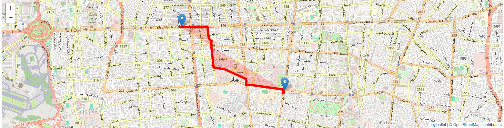
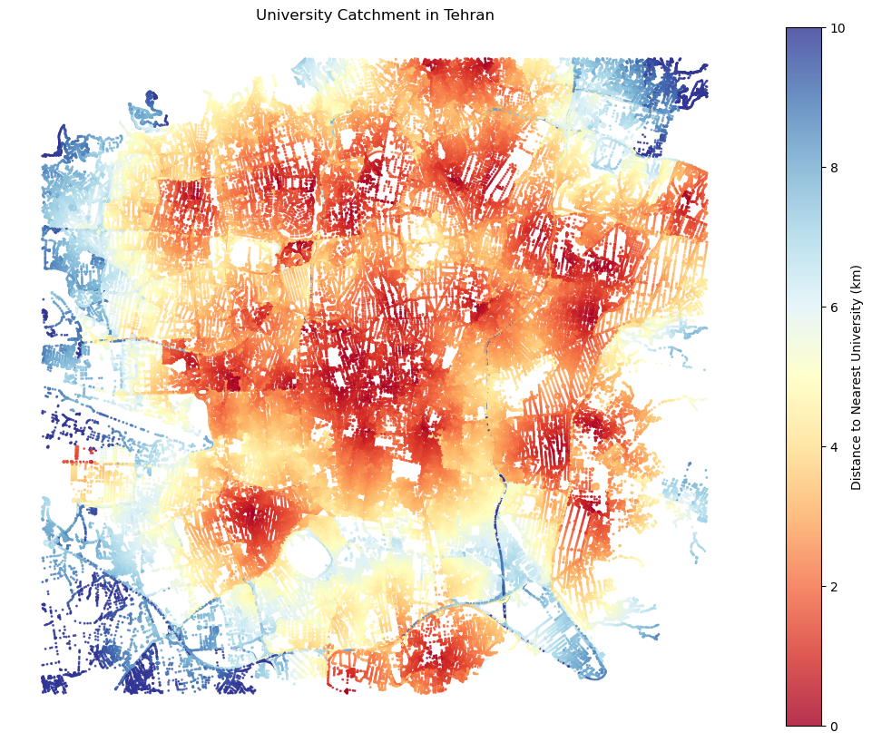

# Tehran Network Project

A collaborative Jupyter Notebook project that explores Tehran's road network using **OpenStreetMap** data.

## Authors

- Zahra Gharib
- Seyed Sajjad Qavami

This project was developed collaboratively as part of the Advanced Programming course.

## Project Overview

The project contains two main analyses:

1. an interactive shortest-path tool for Tehran's driving network;
2. a university accessibility visualization based on road-network distance.

## Part 1 — Interactive Shortest Path

The notebook loads Tehran's driving network and displays an interactive map. The user selects two points, the selected coordinates are matched to nearby graph nodes, and the shortest route by road length is calculated and drawn on the map.



Main tools:

- `pyrosm` — Tehran/OpenStreetMap data
- `osmnx` — nearest-node lookup and shortest-path operations
- `ipyleaflet` — interactive map, markers, and route visualization

## Part 2 — University Accessibility

The second section extracts university points of interest, matches them to the road network, and uses multi-source Dijkstra distances to measure the road-network distance from nodes to the nearest university.

The result is visualized as a distance-colored map of Tehran.



Main tools:

- `pyrosm`
- `osmnx`
- `networkx`
- `numpy`
- `matplotlib`

## Installation

Python 3 is required.

Creating a virtual environment is recommended:

```bash
python -m venv .venv
```

Activate the environment, then install the dependencies:

```bash
pip install -r requirements.txt
```

## Run

Start JupyterLab:

```bash
jupyter lab
```

Then open:

```text
tehran_network_project.ipynb
```

Run the notebook cells in order.

> The notebook calls `pyrosm.get_data("Tehran")`, so the first run may require an internet connection to obtain the Tehran OpenStreetMap dataset.

## Project Structure

```text
05-tehran-network/
├── README.md
├── requirements.txt
├── tehran_network_project.ipynb
└── assets/
    ├── shortest_path.png
    └── university_catchment.png
```

## Repository Note

The notebook was cleaned for GitHub by removing duplicated step-by-step code fragments while keeping the complete working implementation. The project logic was not changed, and the example outputs are preserved as images in `assets/`.
